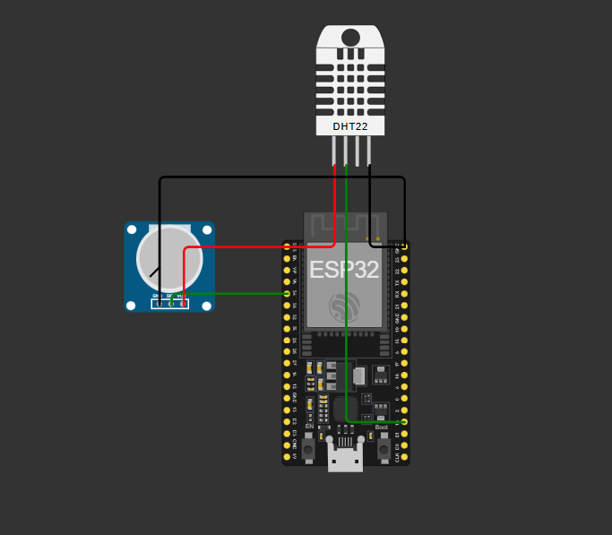
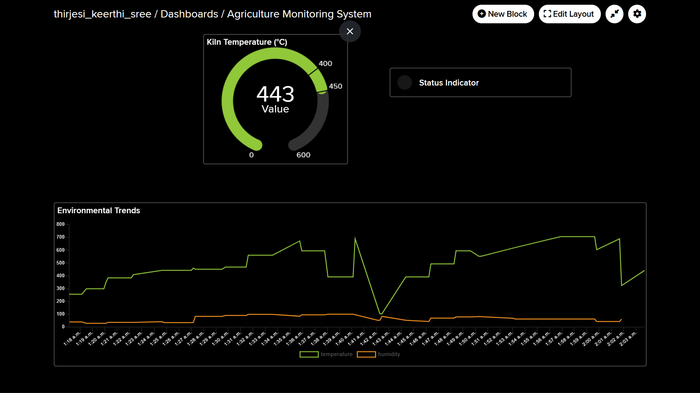
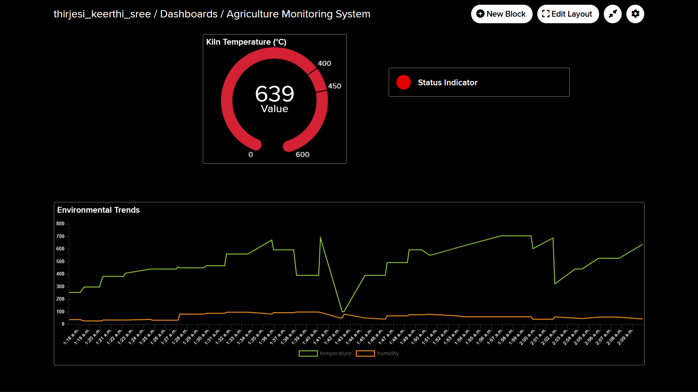

# Remote Environmental Telemetry & Ground-Based Monitoring System

This project is a **Ground-Based Monitoring Node** built using the **ESP32 microcontroller**. It measures **temperature, humidity, and gas levels** in real-time and transmits the data to a **cloud dashboard** using the **MQTT protocol**.

The system enables **remote environmental monitoring**, allowing users to track conditions from anywhere and receive **automatic alerts during emergencies**.

---

## 🚀 Key Features

- **Real-Time Monitoring**: Tracks temperature, humidity, and gas levels every 10 seconds  
- **Smart Alerts**: Sends automated email notifications during unsafe conditions  
- **Cloud Dashboard**: Visualizes data using gauges and historical charts  
- **Low-Bandwidth Communication**: Uses MQTT for efficient and reliable data transfer  
- **Virtual Prototyping**: Designed and tested using the Wokwi simulation platform  

---

## 🛠️ System Architecture

The system operates in three stages:

### 1. Sensing
- **DHT22 Sensor**: Measures temperature and humidity  
- **MQ-2 Gas Sensor (Simulated)**: Detects gas concentration  

### 2. Processing
- **ESP32 Microcontroller**:
  - Converts analog signals using ADC  
  - Processes data into readable values (°C, %, PPM)  

### 3. Telemetry
- Data is transmitted via **Wi-Fi** using **MQTT**
- Sent to the **Adafruit IO cloud platform**  

---

## 📦 Hardware Components

| Component        | Function                                  |
|-----------------|-------------------------------------------|
| ESP32 DevKit    | Main controller with built-in Wi-Fi       |
| DHT22 Sensor    | Temperature and humidity sensing          |
| Potentiometer   | Simulates MQ-2 gas sensor                 |
| Power Source    | 5V adapter or battery                     |

---

## 💻 Software & Tools

- **Embedded C++** – Firmware development for ESP32  
- **MQTT Protocol** – Lightweight communication protocol  
- **Adafruit IO** – Cloud dashboard and alerts  
- **Wokwi** – Simulation and testing platform  

---

## ⚠️ Safety Logic (Automatic Alerts)

The system continuously monitors environmental thresholds:

- **Overheat Alert**: Triggered if temperature exceeds **450°C**  
- **Gas Leak Alert**: Triggered if gas levels exceed **200 PPM**  

**Action Taken:**
- Automated **email notification** is sent immediately  
- Dashboard displays alert status  

---

## 📊 Live Links

- **Circuit Simulation**: [Wokwi Project Link](https://wokwi.com/projects/456594262811280385)  
- **Live Dashboard**: [Adafruit IO Dashboard](https://io.adafruit.com/thirjesi_keerthi_sree/dashboards/agriculture-monitoring-system)  

---

## 📸 Project Screenshots

### 1. Circuit Design (Wokwi)

  

### 2. Cloud Dashboard (Normal Conditions)

  

### 3. Cloud Dashboard (Alert Triggered)

  

---

## 🌟 Future Scope

- Implement **LoRa communication** for long-range monitoring  
- Add **solar power support** for autonomous operation  
- Integrate **GPS for location-based environmental tracking**  

---

## 👨‍💻 Author

**Thirjesi Keerthi Sree**  
B.Tech Student, IIT (ISM) Dhanbad  

Focus Areas: **Embedded Systems, IoT, and Remote Telemetry**
